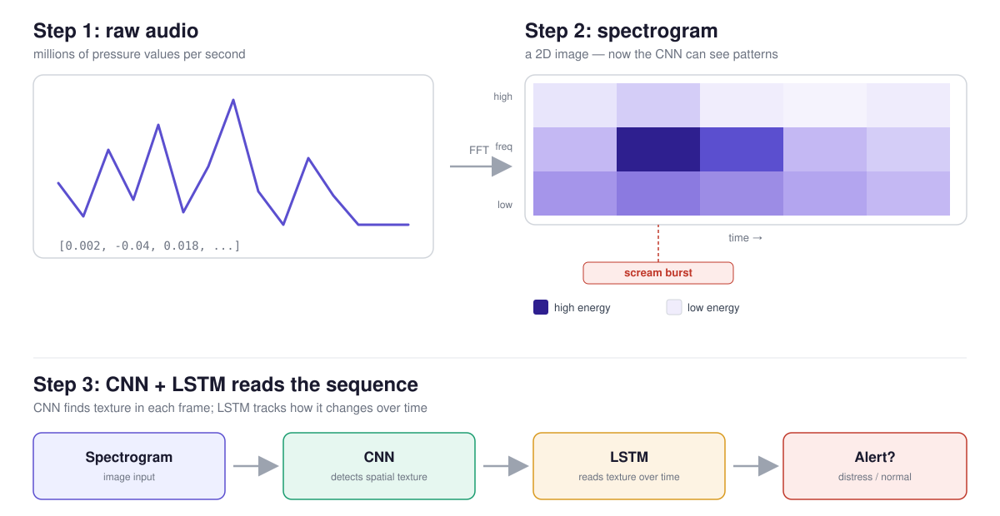

# 🎙️ AffectCare-Extended

> **A distress signal shouldn't need a button.**

AffectCare-Extended is a CNN+LSTM audio classifier that listens for vocal distress — screams, cries for help, panic — and flags it, designed around a single non-negotiable rule: **missing a real emergency is worse than a false alarm.** Built as a portfolio project exploring elderly-care safety monitoring through applied deep learning.

This extended version features a **React Web App** that runs the trained PyTorch model directly in the browser via ONNX Runtime, offering an interactive, real-time dashboard without relying a backend server for inference.

---

## ✨ What it does

Launch the web app, allow microphone access or upload an audio file (`.wav`, `.mp3`, `.flac`), and the browser will instantly tell you if it detects distress.



---

## 🧠 Why CNN + LSTM

Raw audio is just a long list of pressure values — no shape a neural network can learn from. The pipeline first converts each clip into an **MFCC spectrogram**: a 2D "image" of the sound, with frequency on one axis and time on the other.

- **CNN** — scans that image for local spatial patterns (the _texture_ of a scream vs. a hum)
- **LSTM** — reads the CNN's output as a sequence, capturing how those patterns unfold _over time_ across the clip, not just a single frame

Neither alone is enough: a CNN sees shapes but not sequence; an LSTM needs something structured to read. Together they cover both.

---

## 📉 Why recall over precision

In elderly care, a **missed distress signal** (false negative) can cost a life. A **false alarm** (false positive) costs a caregiver a few minutes checking on nothing. Those two mistakes are not equally bad — so this project deliberately optimizes for **catching every possible emergency**, even at the cost of more false alarms:

- `BCEWithLogitsLoss` with `pos_weight=1.5` — penalizes missed distress harder than false alarms during training
- A **low decision threshold (0.15)**, not the default 0.5 — even a moderate suspicion triggers an alert
- **F1-based early stopping**, not accuracy or raw recall — this matters more than it sounds (see below)

### The trap I hit and fixed

Early on, saving the "best" checkpoint by **recall alone** produced a model that flagged almost everything as distress — 96% recall, but 72 out of 80 normal sounds triggered false alarms. Technically high-recall, practically useless — like a car alarm that goes off when a leaf lands on it.

Switching the checkpoint criterion to **F1 score** (which only rewards models that balance recall _and_ precision) fixed this and produced a genuinely usable result. This was the single most important debugging lesson of the project.

---

## 📊 Results

Final model, threshold = 0.15, evaluated on a held-out 20% test split (~800 files):

| Metric                      | Score      |
| --------------------------- | ---------- |
| Recall (emergencies caught) | **91.00%** |
| Precision (real alarms)     | 81.43%     |
| F1 Score                    | 85.94%     |

**Confusion Matrix**
- **True Positives**: 364
- **True Negatives**: 315
- **False Positives**: 83
- **False Negatives**: 36

These metrics are available interactively in the web application's **Insights** tab, dynamically fed by `metrics.json` directly from the training loop.

---

## 🔍 Dataset

~4,000 audio clips, perfectly balanced across two classes:

| Class      | Source                                                                                                                                                                             |
| ---------- | ---------------------------------------------------------------------------------------------------------------------------------------------------------------------------------- |
| `distress` | Human scream / distress vocalization clips sourced from a Kaggle audio dataset [Human Scream Dataset](https://www.kaggle.com/datasets/whats2000/human-screaming-detection-dataset) |
| `normal`   | [ESC-50: Dataset for Environmental Sound Classification](https://github.com/karolpiczak/ESC-50) (ambient/household/urban sounds) + LibriSpeech + supplementary calm speech clips                 |

### A real finding, not a footnote: the siren confusion

A dataset audit (`src/audit_dataset.py`) flagged several ESC-50 "normal" clips with scream-level energy — most were legitimately loud sounds (sirens, chainsaws, trains), but the **siren clips (`-42` category) stood out**: sustained, high-pitched, high-energy bursts that are acoustically close to a scream. This is a real, observed case of spurious correlation in a real dataset, not a hypothetical — sirens and human screams share enough spectral shape that a model trained without care could confuse them.

### The whisper test

`predict.py` was also tested against a genuine recorded whisper (not a volume-scaled scream) simulating someone quietly calling for help. Result: correctly flagged as distress, but at **35% confidence** — well above the 0.15 threshold, but meaningfully weaker than the ~97% confidence given to loud screams. This points to a real limitation: the `distress` class likely skews toward _loud_ vocalizations, so the model has learned "loud + sharp = distress" more strongly than the deeper acoustic qualities of fear itself. Documented honestly below under Future Work.

---

## 🧪 Key design decisions

**`n_mfcc=13`, not 40.** I tested both. 40 coefficients gave the model more raw detail — and more room to memorize the ~640 training clips instead of generalizing (loss dropped to 0.03, but test recall _fell_). At this dataset size, 13 coefficients generalized better. A direct, observed example of the bias-variance tradeoff, not just a textbook definition.

**Gradient clipping + a seeded run.** Early training runs showed wild, non-reproducible swings in recall (76% to 97%) between runs with identical settings — turned out `torch.manual_seed(42)` wasn't locking down all the randomness sources, and a mid-training loss spike (a classic exploding-gradient symptom) was throwing results around. Adding `torch.nn.utils.clip_grad_norm_` and confirming a fixed seed made results trustworthy enough to actually compare across experiments.

**Deep-copying the "best" checkpoint.** `model.state_dict()` returns a live reference, not a frozen snapshot — an early version of the checkpointing code silently "restored" the final overfit model instead of the actual best one. `copy.deepcopy()` fixed it. A subtle, classic PyTorch gotcha worth knowing.

---

## 📁 Project structure

```text
AffectCare-Extended/
├── frontend/               # React Web App (ONNX Runtime browser inference)
│   └── public/             # Holds best_model.onnx, scaler.json, and metrics.json
├── ML-Backend/
│   ├── data/processed/     # cached MFCC arrays (X.npy, y.npy)
│   ├── dataset/            # raw audio, gitignored — distress/ and normal/
│   ├── results/            # holds training metrics.json
│   ├── export_onnx.py      # exports PyTorch model to ONNX for the frontend
│   └── src/
│       ├── preprocessing.py# load → trim → fix_length → MFCC extraction
│       ├── model.py        # CNN+LSTM architecture
│       ├── train.py        # training loop, F1-based early stopping
│       ├── best_model.pth  # trained weights
│       ├── scaler.pkl      # fitted StandardScaler
│       └── requirements.txt
```

---

## ⚙️ Installation & usage

### 1. Run the Web App (Frontend)
The web app requires no Python. Simply run it via Node/NPM:
```bash
cd frontend
npm install
npm run dev
```

### 2. Retrain the Model (Backend)
If you wish to retrain the model on new data, you must use **Python 3.10** (to ensure `llvmlite` and `numba` dependencies compile correctly on older machines).

```bash
cd ML-Backend
python3.10 -m venv venv
source venv/bin/activate
pip install -r requirements.txt
```

**Retraining Process:**
```bash
cd src
python3 preprocessing.py   # extracts MFCCs from dataset/, saves to data/processed/
python3 train.py           # trains, saves best_model.pth, scaler.pkl, and metrics.json

cd ..
python3 export_onnx.py     # Exports the updated model and metrics straight to frontend/public/
```

---

## 🤝 Notes

Built as a solo learning project — every line of the model and training loop was written and debugged personally, including chasing down non-reproducible results, a `state_dict()` reference bug, and an overfitting spiral, before landing on the final approach. The gaps above are named on purpose: an honest account of what's simple/early is worth more than an oversold claim.

---

_Built with PyTorch, Librosa, React, ONNX Runtime Web, and a lot of confusion matrices._ 🎧
